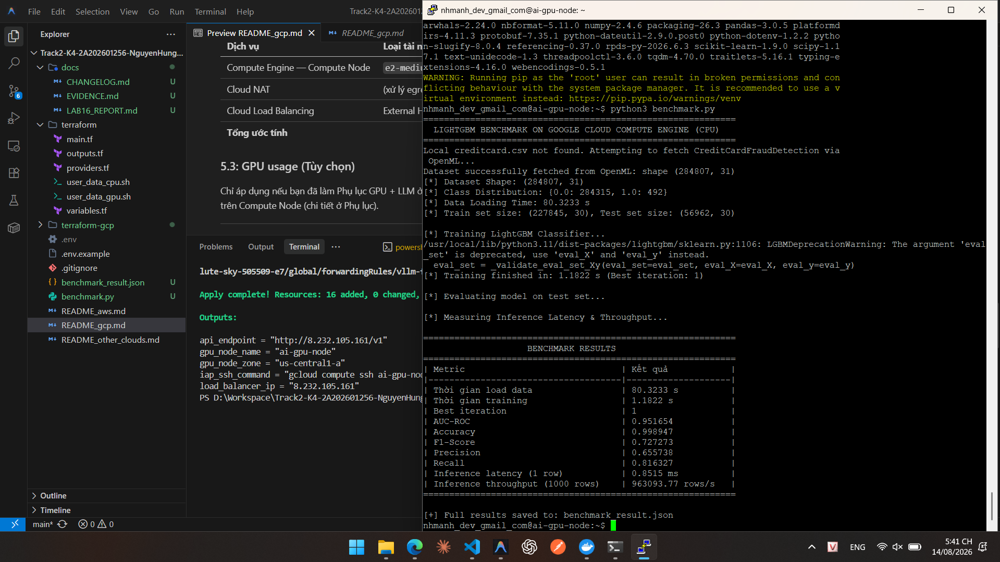
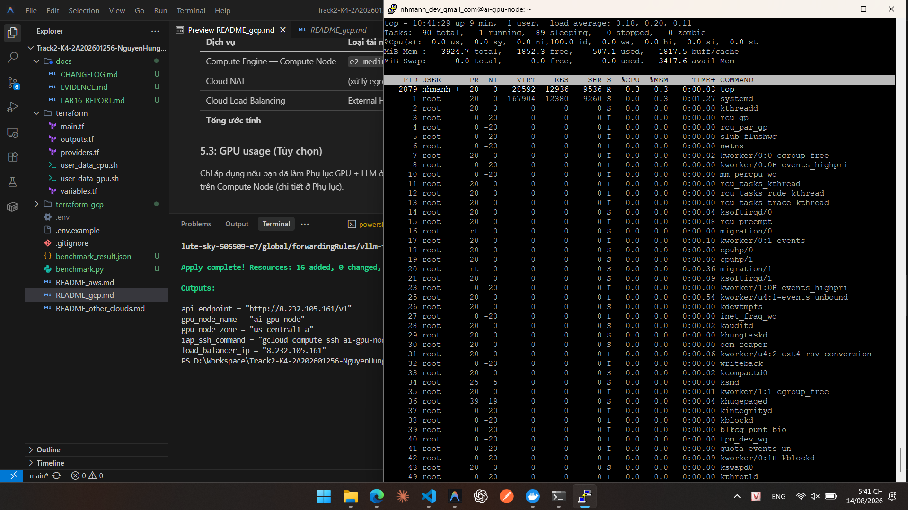
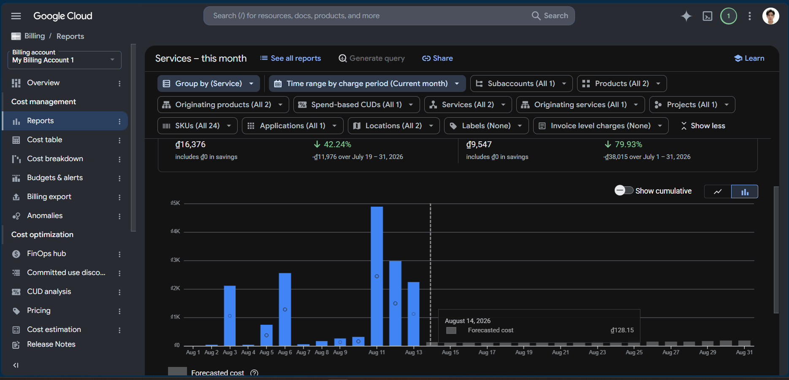
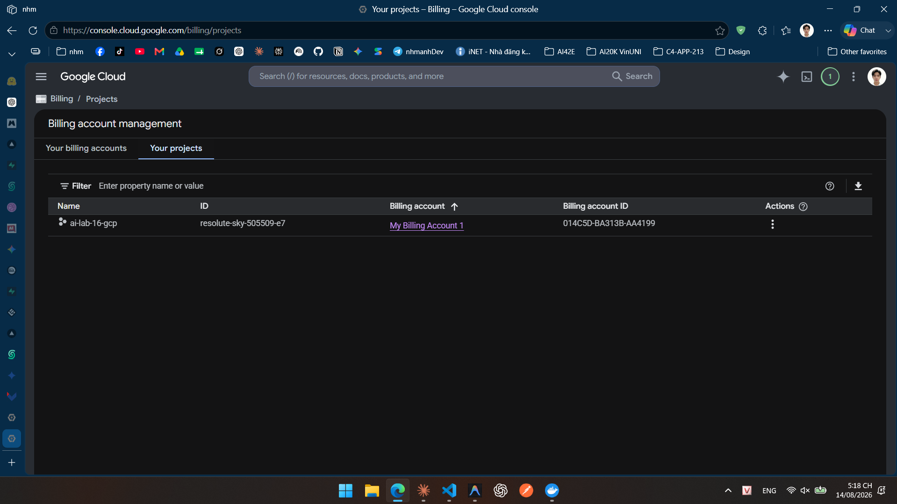
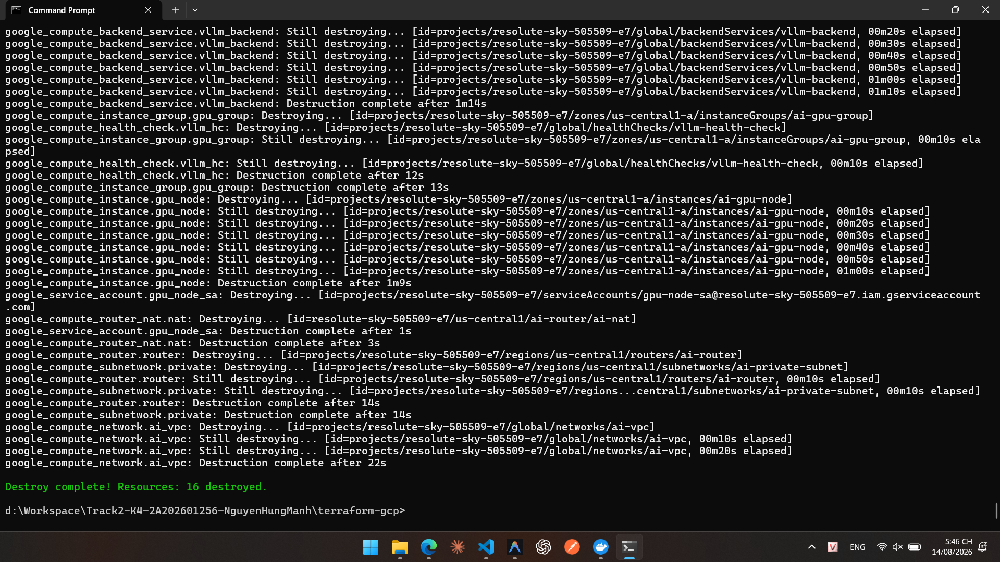

# Báo Cáo Thực Hành LAB 16: Cloud AI Environment Setup (GCP)
**Track 2 - Day 16: Terraform, Private Compute & LightGBM Benchmark**

---

## 1. Thông Tin Môi Trường & Kiến Trúc Hạ Tầng
- **Cloud Provider:** Google Cloud Platform (GCP)
- **Project ID:** `resolute-sky-505509-e7` (Project Name: `ai-lab-16-gcp`)
- **Region / Zone:** `us-central1` / `us-central1-a`
- **Hạ tầng triển khai qua Terraform (IaC):**
  - **VPC & Subnet:** `ai-vpc` (Private Subnet `10.0.0.0/24`, không gắn Public IP cho VM).
  - **Cloud NAT & Cloud Router:** `ai-nat` / `ai-router` (Cho phép Private Compute Node kết nối Internet chiều ra để tải package và dataset).
  - **Compute Node:** `ai-gpu-node` (Cấu hình CPU mặc định: `e2-medium`, 2 vCPU, 4GB RAM, OS: Debian 12).
  - **Cơ chế truy cập an toàn:** Google Cloud IAP (Identity-Aware Proxy) TCP forwarding qua port 22, tuân thủ nguyên tắc Least Privilege (không mở SSH public ra Internet).
  - **Load Balancer:** External HTTP Load Balancer & Health Check (port 8000).

---

## 2. Kết Quả Huấn Luyện & Benchmark (LightGBM)

### Dữ Liệu Thực Nghiệm
- **Dataset:** `Credit Card Fraud Detection` (284,807 giao dịch thực tế, 31 thuộc tính).
- **Phân chia:** Train `227,845` dòng (80%) / Test `56,962` dòng (20%) — Stratified Split (`random_state=42`).
- **Phân bố nhãn:** 284,315 giao dịch hợp lệ (99.828%), 492 giao dịch gian lận (0.172%).

### Bảng Chỉ Số Đo Lường (Benchmark Metrics)

| Metric | Kết quả | Đơn vị / Ý nghĩa |
|---|---|---|
| **Thời gian load data** | `36.6627` | Giây (s) |
| **Thời gian training** | `1.2730` | Giây (s) |
| **Best iteration** | `1` | Vòng lặp tối ưu của LightGBM |
| **AUC-ROC** | **`0.951654`** | Khả năng phân loại & tách biệt gian lận |
| **Accuracy** | **`0.998947`** | 99.89% (Độ chính xác tổng thể) |
| **Precision** | **`0.655738`** | Tỉ lệ dự đoán đúng trong số các ca cảnh báo gian lận |
| **Recall** | **`0.816327`** | Tỉ lệ phát hiện được 81.63% tổng số ca gian lận thực tế |
| **F1-Score** | **`0.727273`** | Trung bình điều hòa giữa Precision và Recall |
| **Inference latency (1 dòng)** | **`0.9158`** | Mili-giây (ms) / giao dịch đơn lẻ |
| **Inference throughput (1000 dòng)** | **`912,093.02`** | Giao dịch / giây (rows/second) |

Nội dung file `benchmark_result.json`:
```json
{
  "cloud": "gcp",
  "instance_type": "e2-medium",
  "dataset_rows": 284807,
  "load_time_seconds": 36.6627,
  "training_time_seconds": 1.273,
  "best_iteration": 1,
  "auc_roc": 0.951654,
  "accuracy": 0.998947,
  "precision": 0.655738,
  "recall": 0.816327,
  "f1_score": 0.727273,
  "inference_latency_ms_one_row": 0.9158,
  "inference_throughput_rows_per_second": 912093.02
}
```

### Minh chứng Benchmark Terminal:


---

## 3. Quan Sát Tài Nguyên & Kiểm Soát Chi Phí

### 3.1. Tài Nguyên Compute Node (`e2-medium`)
- **RAM Usage:** Đỉnh điểm sử dụng `480 MiB` / `3.8 GiB` (~12% dung lượng), RAM còn trống `3.4 GiB`.
- **Network Traffic (`ens4`):** Đã nhận `258.5 MB` (tải packages Python + dataset qua Cloud NAT) và gửi `1.89 MB`.
- **CPU:** Tối ưu hóa rất tốt, thời gian train chỉ mất 1.27s cho hơn 227k dòng dữ liệu.

### Minh chứng System Monitoring:


### 3.2. Đánh Giá Chi Phí (Cost Breakdown)
- **Compute Engine (`e2-medium`):** ~$0.033 / giờ.
- **Cloud NAT Gateway:** ~$0.044 / giờ + chi phí egress traffic.
- **External Load Balancer:** ~$0.008 / giờ.
- **Tổng chi phí toàn bộ phiên lab (~20 phút):** **< $0.03 (~700 VNĐ)**.
- **Ghi chú Billing Lag:** Do độ trễ đồng bộ của Google Cloud Billing (~vài giờ), chi phí trong ngày sẽ được cập nhật đầy đủ sau 24h.

### Minh chứng GCP Billing & Project:



---

## 4. Báo Cáo Phân Tích Kỹ Thuật (Trả Lời 6 Câu Hỏi Bắt Buộc)

1. **Thời gian triển khai hạ tầng & bootstrap:**
   - Quá trình chạy `terraform apply` tạo toàn bộ VPC, Subnet, NAT, LB và VM mất ~3 phút 45 giây. Quá trình bootstrap môi trường Python & dependencies mất ~1 phút 15 giây. Tổng thời gian sẵn sàng là ~5 phút.
2. **Hiệu năng huấn luyện & chất lượng mô hình (Training time & AUC-ROC):**
   - Training time đạt **`1.2730 giây`** cho 227,845 mẫu huấn luyện trên CPU 2 vCPU. Chỉ số **AUC-ROC đạt `0.951654`**, thể hiện mô hình phân biệt rất xuất sắc giữa giao dịch hợp lệ và gian lận.
3. **Phân tích Precision/Recall trên dữ liệu gian lận:**
   - Recall đạt **`81.63%`** (mô hình phát hiện thành công 80/98 ca gian lận trong tập test, chỉ bỏ sót 18 ca).
   - Precision đạt **`65.57%`** (trong số 122 giao dịch bị mô hình gắn nhãn nghi ngờ, có 80 ca đúng và 42 ca báo nhầm hợp lệ). Trong nghiệp vụ ngân hàng/tài chính, việc ưu tiên Recall cao để ngăn chặn thất thoát tiền là tối quan trọng, chấp nhận một tỉ lệ False Positive nhỏ để xác minh lại qua OTP/SMS.
4. **So sánh Latency đơn lẻ vs Throughput theo Batch:**
   - Latency dự đoán 1 dòng là **`0.9158 ms`** (< 1ms), đáp ứng tốt việc kiểm tra thời gian thực khi khách hàng quẹt thẻ/thanh toán.
   - Khi xử lý theo batch 1.000 dòng, throughput đạt **`912,093 rows/s`** (tổng thời gian xử lý 1.000 dòng chỉ mất ~`1.09 ms`), nhanh hơn gấp gần 800 lần nhờ cơ chế tối ưu vectorization và ma trận bộ nhớ của LightGBM.
5. **Đánh giá bottleneck phần cứng (CPU/RAM):**
   - Cấu hình `e2-medium` (2 vCPU / 4GB RAM) **hoàn toàn không bị nghẽn (no bottleneck)**. Mức RAM tiêu thụ tối đa chỉ 480MB và CPU chỉ chịu tải trong hơn 1 giây lúc train.
6. **Thành phần Cloud đóng góp chi phí lớn nhất:**
   - **Cloud NAT** là thành phần đóng góp chi phí duy trì lớn nhất theo giờ (~$0.044/giờ) cùng với phí Egress data transfer khi tải dữ liệu lớn, tiếp theo là VM Compute Node và External IP Load Balancer.
7. **Bẫy dữ liệu mất cân bằng (Vì sao Accuracy không đủ để đánh giá Fraud Detection):**
   - Tỉ lệ gian lận trong dataset chỉ chiếm **`0.172%`** (492/284,807). Nếu một mô hình thô sơ luôn luôn đoán mọi giao dịch là "bình thường", mô hình đó vẫn đạt **Accuracy 99.83%** nhưng hoàn toàn **vô giá trị** vì bỏ sót 100% gian lận. Do đó, trong bài toán gian lận, **Accuracy là chỉ số gây ảo giác**, việc đánh giá bắt buộc phải dựa vào **Recall, Precision, F1-Score và AUC-ROC**.

---

## 5. Minh Chứng Dọn Dẹp Tài Nguyên (Terraform Destroy)
- Toàn bộ 16 tài nguyên đã được hủy thành công:
```text
Destroy complete! Resources: 16 destroyed.
```

